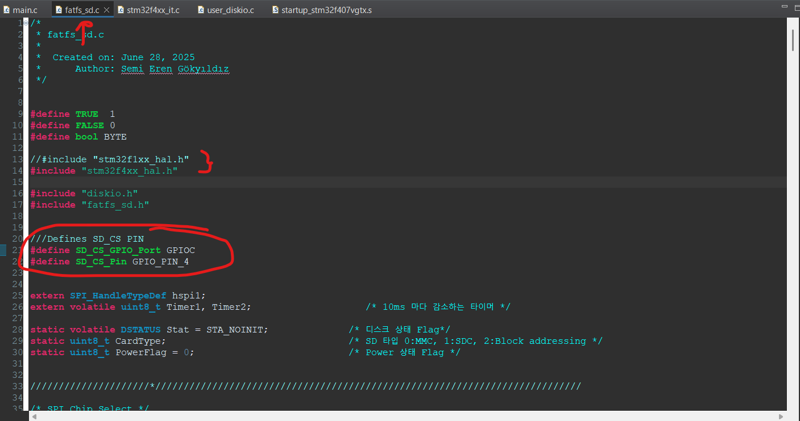
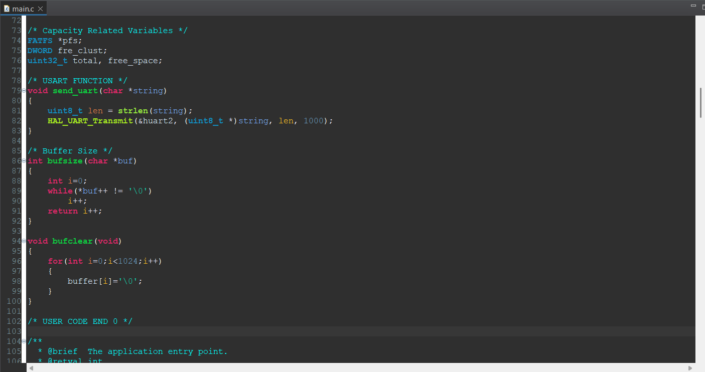

# STM32 SD CARD
This project demonstrates how to create, write to, and delete a `.txt` file on an SD card using the STM32F407VG microcontroller. The project uses the FATFS file system along with HAL drivers and some custom-added libraries.

- **Link headers**
  - [Project Overview](#-project-overview)<br/>
  - [Hardware Connections](#-hardware-connections)<br/>
  - [Tools Used](#-tools-used)<br/>
  - [Project Setup](#-project-setup)<br/>
  - [Project Structure](#-project-structure)<br/>
  
## 📁 Project Overview

- STM32F407VG (Discovery) board
- SD card (formatted as FAT32)
- Communication via SDIO or SPI (depending on your setup)
- FATFS file system
- STM32 HAL drivers
- USB to TLL (For UART)
- Custom libraries/files added to the project. (fatfs_sd.c, fatfs_sd.h)


*SD Card Module*

## ⚙️ Hardware Connections

| SD Card Pins | STM32F407VG Pins | Description         |
|--------------|------------------|---------------------|
| CS (for SPI) | PC4  / GPIO      | Chip Select (SPI)   |
| SCK          | PA5  / SDIO/SPI  | Clock               |
| MISO         | PA6  / SDIO/SPI  | Master In Slave Out |
| MOSI         | PA7  / SDIO/SPI  | Master Out Slave In |
| VCC          | 5V               | Power Supply        |
| GND          | GND              | Ground              |

> Note: You need to supply the SD Card Module with 5V.

> If you are using SDIO, make sure the appropriate SDIO pins are connected and enabled via STM32CubeMX.
## 🧰 Tools Used

- STM32CubeMX
- STM32CubeIDE
- FATFS Middleware
- STM32 HAL Libraries
- Additional custom libraries:
  - fatfs_sd.c
  - fatfs_sd.h

## 🛠️ Project Setup
The Modules to be used in the project are <strong>SPI1</strong> and <strong>USART2</strong>. As you can see, pin adjustment needs to be made.

<hr>

The SPI settings should be as seen. The Prescaler value should be set so that the Baud Rate is generally around <strong>2.5MB</strong>.

<hr>

After the <strong>fatfs_sd.c</strong> and <strong>fatfs_sd.h</strong> files are uploaded into the project, the SD_CS pin and other changes must be made in the <strong>fatfs_sd.c</strong> file
> Note: If you are going to use F1XX instead of F4XX, you need to change the include codes.

<hr>

We need to update the <strong> FATFS/Target/user_diskio.c</strong> file to match our sd card library. Step by step it is necessary to paste the codes in the specified places.

```c
  /* USER CODE BEGIN INIT */
    //Stat = STA_NOINIT;
    //return Stat;
	return SD_disk_initialize(pdrv);
  /* USER CODE END INIT */
```


```c
    /* USER CODE BEGIN STATUS */
    //Stat = STA_NOINIT;
    //return Stat;
    return SD_disk_status(pdrv);
    /* USER CODE END STATUS */
.
.
.
.
    /* USER CODE BEGIN READ */
    //return RES_OK;
    return SD_disk_read(pdrv, buff, sector, count);
    /* USER CODE END READ */
```


```c
    /* USER CODE BEGIN WRITE */
    /* USER CODE HERE */
    //return RES_OK;
    return SD_disk_write(pdrv, buff, sector, count);
    /* USER CODE END WRITE */
```


```c
    /* USER CODE BEGIN IOCTL */
    //DRESULT res = RES_ERROR;
    //return res;
    return SD_disk_ioctl(pdrv, cmd, buff);
    /* USER CODE END IOCTL */
```

<hr>

We need to add some variables and functions to the <strong>stm32f4xx_it.c</strong> file

```c
volatile uint8_t FatFsCnt = 0;
volatile uint8_t Timer1, Timer2;

void SDTimer_Handler(void)
{
	if(Timer1 > 0)
		Timer1--;
	if(Timer2 > 0)
		Timer2--;
}
```


Also update the SysTick_Handler function as below
```c
void SysTick_Handler(void)
{
    /* USER CODE BEGIN SysTick_IRQn 0 */
    
    FatFsCnt++;
    if(FatFsCnt >= 10)
    {
        FatFsCnt=0;
        SDTimer_Handler();
    }

    /* USER CODE END SysTick_IRQn 0 */
    HAL_IncTick();
    /* USER CODE BEGIN SysTick_IRQn 1 */
    /* USER CODE END SysTick_IRQn 1 */
}
```
<hr>

We must define the specified variables in the A file, write the necessary functions.

<hr>

## 🧠 Project Structure
Below is a table explaining the functions of the library.
<hr>

MOUTING: f_mount will mount the SD card. “/” is the path, that we want to mount. fs is the pointer to the file system, which we need to define as a global definition, as we are going to use it a lot.
```c
  /* Mount SD Card */
  fresult = f_mount(&fs, "/", 1);
  if (fresult != FR_OK) send_uart ("SD CARD: ERROR!!! in mounting SD CARD...\n\n");
  else send_uart("SD CARD mounted successfully...\n\n");
```
<hr>
The following code is executed to find out the capacity and free space information of our SD Card.

```c
/* Card Capacity Details */
  f_getfree("", &fre_clust, &pfs);

  total = (uint32_t)((pfs->n_fatent-2) * pfs->csize * 0.5);
  sprintf(buffer, "SD CARD: SD CARD Total Size: \t%lu\n", total);
  send_uart(buffer);
  bufclear();
  free_space = (uint32_t)(fre_clust * pfs->csize * 0.5);
  sprintf(buffer, "SD CARD: SD CARD Free Space: \t%lu\n", free_space);
  send_uart(buffer);
```
<hr>

### CREATE A FILE:

```c
  //Open file to write.(Create a new file if doesn't exist)
  fresult = f_open(&file, "eren.txt", FA_OPEN_ALWAYS | FA_READ | FA_WRITE);
```

<hr>

### WRITING:

```c
  //Writing Text
  fresult = f_puts("SD CARD (eren.txt): Hello World. Selam dunya\n\n", &file);
```

<hr>

### READING:

```c
  //Open file to read
  fresult = f_open(&file, "eren.txt", FA_READ);

  //Read string from the file
  f_gets(buffer, file.obj.objsize, &file);
```

<hr>

### CLOSING:

```c
  //Close file
  fresult = f_close(&file);
```

<hr>

## 📜 License

This project is licensed under the [MIT License](LICENSE).
<hr>
## ✍️ Developer

**Semi Eren Gökyıldız**
